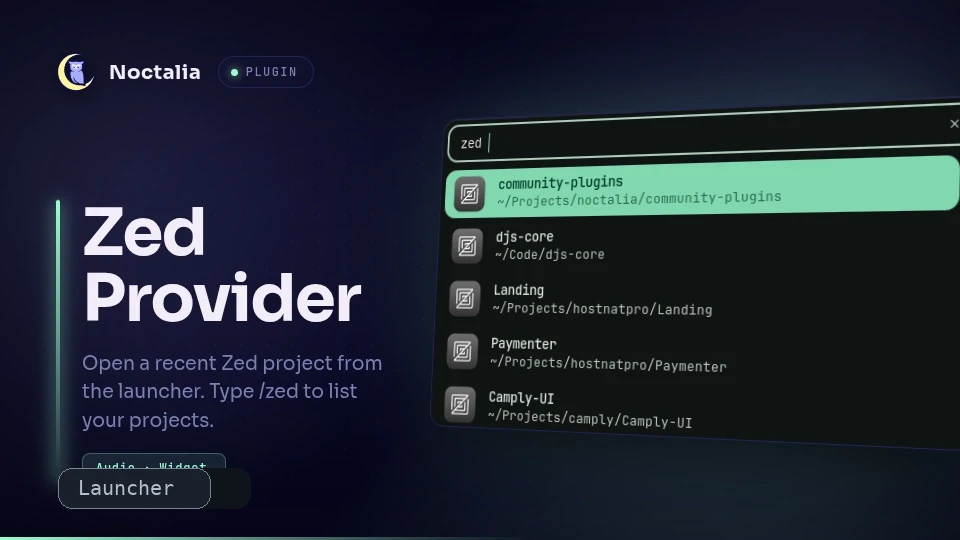

# Zed Provider

Open a recent [Zed](https://zed.dev) workspace from the Noctalia launcher. Type `/zed` in the launcher to list your projects, filter by name, and open the selected one in Zed.

## Features

- Lists recent local Zed workspaces from Zed's SQLite database
- Filter projects as you type
- Opens the selected project with `zeditor`
- Configurable database path and result limit

## Requirements

- [Zed](https://zed.dev) installed (`zeditor` available in your `PATH`)
- `sqlite3` available in your `PATH`

## Behavior

Projects are read from Zed's workspace database, typically at `~/.local/share/zed/db/0-stable/db.sqlite`. Remote workspaces are excluded. The list is cached for the launcher session and refreshed when you clear the query.
